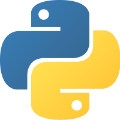

# Curso básico de Python
--------------------------------
En este curso aprenderas a programar en python.

**Requisitos**
- Python 3.6 o superior
- Computadora con Windows, MacOs o Linux
- Editor de Texto como [Visual Studio Code](https://code.visualstudio.com/Download)

